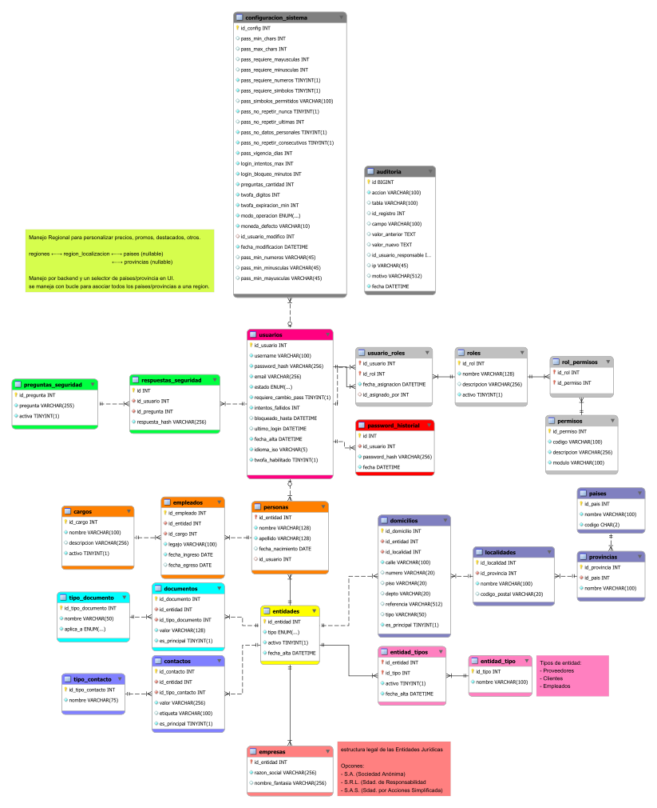

# Database

## Estructura
```
database/
│
├── schema/                         # Scripts SQL para importar DB
│   ├── schema.sql                     # Estructura de la base de datos
│   ├── views.sql                      # Consultas reutilizables
│   ├── routines.sql                   # Store Procedures
│   ├── triggers.sql                   # auditorias automaticas
│   └── full_schema.sql                # Estructura completa de la base de datos
│
├── data/                           # Informacion y datos para usar en DB
│   ├── seed.sql                       # Datos iniciales
│   └── test.sql                       # Datos de prueba
│
├── migrations/                     # Cambios incrementales en DB
│   ├── aaaammddhhmmss_migration.sql   # Cambios incrementales
│   └── ...
│
├── assets/                         # Recursos visuales (diagrama EER)
│   └── aaaammdd.png/svg           # Diagrama EER de la base de datos
│
├── apps/                           # Instalador MySQL Workbench
│   └── mysql-workbench-community-8.0.42-winx64.msi  
│
├── 7mo2da-gonzalito.mwb               # Modelo visual (MySQL Workbench)
├── .gitignore                         # Ignora archivos no necesarios
└── README.md                          # Documentación
```

> [!WARNING] Requisitos
> MySQL version 8.0.x (Workbench/Community) ─ [win64](./apps/mysql-workbench-community-8.0.42-winx64.msi)  


## Orden de ejecución
### MySQL
1. Instalar MySQL v8.0.x 
2. Panel izquierdo -> **Models**
3. Abrir `7mo2da-gonzalito.mwb`

### base de datos
1. schema/full_schema.sql (o schema.sql, views.sql, routines.sql, triggers.sql)
2. data/seed.sql (opcionalmente como extra, test.sql)

## Esquema visual
[](./assets/20260409.svg)
> Haz clic en la imagen para abrirla en una pestaña nueva con zoom completo.


---

> [!NOTE]
> - El archivo `.mwb` contiene el diseño visual completo (diagramas EER), Tablas, los triggers, los stored procedures (Routines) y las consultas reutilizables (Views). Este es el archivo maestro para el diseño de la base de datos. Cualquier cambio en la estructura o lógica de la base de datos debe reflejarse en este archivo para mantener la coherencia entre el diseño visual y los scripts SQL, que deberan ser exportados.
> - Los scripts SQL en la carpeta `schema/` son para importar la estructura y lógica de la base de datos local o proveedor. El script `full_schema.sql` es una combinación de todos los scripts individuales (`schema.sql`, `views.sql`, `routines.sql`, `triggers.sql`) para facilitar la importación completa de la base de datos.
> - Los scripts SQL en la carpeta `data/` son para insertar datos iniciales o de prueba en la base de datos. El script `seed.sql` es para datos iniciales necesarios para el funcionamiento básico, mientras que `test.sql` es para datos adicionales que pueden ser útiles durante el desarrollo o pruebas.
> - La carpeta `migrations/` es para scripts SQL que representan cambios incrementales en la base de datos a lo largo del tiempo. Cada archivo de migración debe seguir una convención de nomenclatura que incluya una marca de tiempo para garantizar el orden correcto de ejecución. Estos scripts son útiles para mantener un historial de cambios y facilitar la actualización de la base de datos en diferentes entornos.